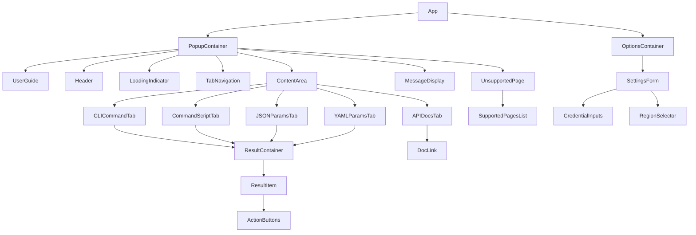
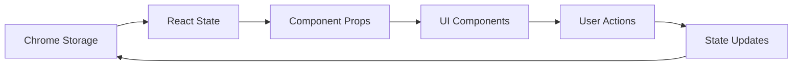
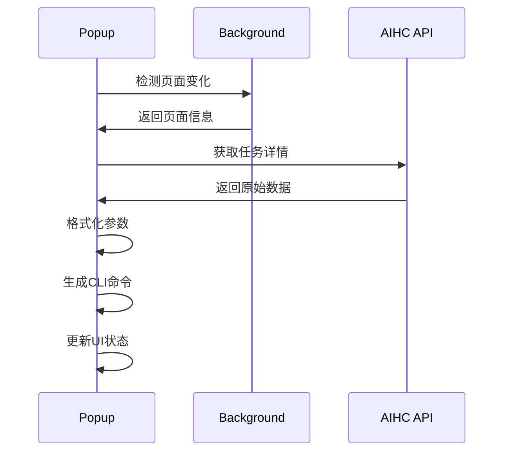

# Vue转React重写设计文档 - AIHC助手浏览器插件

## 概述

AIHC助手是一个专为百舸AIHC控制台设计的浏览器扩展程序，主要功能包括自动检测AIHC控制台页面、生成CLI命令、导出任务参数（JSON/YAML格式）、提供API文档链接等。本设计文档基于最新的Vue实现，详细描述了将其重写为React版本的完整架构方案。

### 目标页面支持
- 资源池列表页面：显示资源池CLI命令和API文档
- 资源池详情页面：根据clusterUuid生成特定命令  
- 队列列表页面：显示队列相关CLI命令
- 任务列表页面：任务列表查询命令生成
- 任务详情页面：完整的任务操作命令集（包含API调用和参数解析）

### 核心功能特性
- 智能页面检测：自动匹配URL模式并识别页面类型
- CLI命令生成：基于页面参数自动生成aihc命令
- 多格式导出：支持JSON、YAML、TXT格式的参数导出
- 一键复制功能：带视觉反馈的剪贴板操作
- API文档集成：快速访问相关技术文档
- 用户引导系统：新手友好的使用指南
- 侧边栏集成：通过content script注入的悬浮按钮和侧边栏

## 技术栈架构

### React技术栈选择
- **React 18**: 核心UI框架，利用并发特性和新的Hooks
- **TypeScript**: 类型安全和更好的开发体验
- **React Hooks**: 状态管理和副作用处理
- **CSS Modules**: 样式隔离和组件化样式管理
- **Vite**: 构建工具，快速开发和热更新

### 构建和打包配置
- 使用Vite配置多入口点构建（popup、options、content、background）
- TypeScript配置支持Chrome Extension API
- 样式预处理和CSS模块化支持
- 图标自动生成脚本集成

## 组件架构设计

### 最新组件层次结构

### 核心组件定义

#### PopupContainer组件
- **状态管理**：当前标签页、加载状态、页面信息、任务参数、消息通知
- **生命周期**：页面检测、URL变化监听、数据获取和API调用
- **用户交互**：标签切换、内容复制、文件保存、消息处理
- **页面检测逻辑**：基于URL模式匹配的智能页面识别

#### Header组件
- 显示插件标题（左对齐布局）
- 当前页面类型指示
- 简洁的视觉设计风格

#### LoadingIndicator组件
- 自定义加载动画（旋转器 + 文本）
- 在API调用期间显示加载状态
- 居中布局和动画效果

#### TabNavigation组件
- **动态标签渲染**：基于可用数据动态显示标签页
- **支持的标签类型**：CLI命令、启动命令、JSON参数、YAML参数、API文档
- **交互特性**：激活状态管理、悬停效果、响应式布局
- **样式增强**：底部边框指示器、过渡动画效果

#### MessageDisplay组件
- **多类型消息展示**：成功、错误、警告、信息四种类型消息
- **自动消失机制**：可配置的自动清除时间
- **手动关闭功能**：用户可手动关闭消息通知
- **动画效果**：滑入动画和渐隐效果
- **边框指示器**：不同类型消息的颜色边框区分

#### OptionsContainer组件
- **设置表单状态**：用户凭证、区域选择、保存状态
- **表单验证**：实时验证和错误提示
- **数据持久化**：使用Chrome Storage API同步存储
- **用户体验优化**：保存成功反馈、错误处理机制

### 数据流架构

#### 状态管理策略

#### 关键状态对象
- `activeTab`: 当前激活的标签页
- `isLoading`: 数据加载状态
- `currentPage`: 当前页面类型
- `taskParams`: 任务参数数据集合
- `message`: 消息通知对象
- `settings`: 用户设置配置

## 页面检测与URL解析

### 页面类型识别逻辑

#### URL模式匹配表
| URL模式 | 页面类型 | 功能描述 |
|---------|----------|----------|
| `/aihc/resources` | 资源池列表 | 显示资源池CLI命令和API文档 |
| `/aihc/resource/info?` | 资源池详情 | 根据clusterUuid生成特定命令 |
| `/aihc/resource/queue?` | 队列列表 | 显示队列相关CLI命令 |
| `/aihc/tasks?` | 任务列表 | 任务列表查询命令生成 |
| `/aihc/infoTaskIndex/detail?` | 任务详情 | 完整的任务操作命令集 |

#### URL参数解析策略
- 使用URLSearchParams API解析查询参数
- 提取关键参数：clusterUuid、jobId、queueID、k8sName等
- 参数验证和默认值处理

### 数据获取和处理

#### API调用流程

#### 任务参数格式化
- 原始API响应数据清理
- 资源配置标准化
- 环境变量过滤和格式化
- 数据源类型转换

## CLI命令生成策略

### 命令构建规则

#### 基础命令结构
- 基本格式：`aihc [操作] [参数]`
- 参数换行和格式化
- 特殊字符转义处理

#### 参数映射逻辑
- 资源池ID映射到`-p`参数
- GPU资源配置转换
- RDMA和网络配置处理
- 环境变量批量添加

#### 命令优化策略
- 长命令分行显示
- 可选参数智能省略
- 参数顺序标准化

### YAML/JSON导出

#### 数据结构转换
- 嵌套对象扁平化处理
- 数组和对象格式化
- 类型转换和验证

#### 文件生成流程
- 数据序列化（JSON.stringify/yaml.dump）
- Blob对象创建
- 下载链接生成和触发

## 用户交互设计

### 复制功能实现

#### 剪贴板API集成
- 使用navigator.clipboard.writeText()
- 兼容性检查和降级方案
- 复制状态视觉反馈

#### 按钮状态管理
- 复制前后的按钮文本变化
- 视觉样式变化（颜色、动画）
- 自动恢复原始状态

### 消息通知系统

#### 消息类型定义
- 成功消息：绿色，自动消失
- 错误消息：红色，手动关闭
- 警告消息：黄色，中等持续时间
- 信息消息：蓝色，标准持续时间

#### 消息队列管理
- 多消息并发显示
- 优先级排序机制
- 自动清理过期消息

## 设置页面架构

### 表单组件设计

#### 凭证管理界面
- Access Key输入框（文本类型）
- Secret Key输入框（密码类型）
- 区域选择下拉框

#### 表单验证逻辑
- 必填字段验证
- 格式正确性检查
- 实时验证反馈

### 数据持久化

#### Chrome Storage API集成
- 使用chrome.storage.sync进行云同步
- 本地存储备份机制
- 数据加密和安全处理

## Background Script设计

### 消息处理系统

#### 消息路由表
| Action | 处理函数 | 返回数据 |
|--------|----------|----------|
| `getCredentials` | getCredentials() | 用户凭证信息 |
| `generateParams` | generateTaskParams() | 格式化参数 |
| `getPopupContent` | getPopupContent() | 页面特定内容 |
| `openOptionsPage` | openOptionsPage() | 操作结果 |

#### 异步处理模式
- Promise-based消息处理
- 错误捕获和传播
- 超时处理机制

### 页面内容生成

#### 动态内容构建
- 基于当前URL生成页面特定内容
- 参数提取和命令预生成
- HTML字符串模板渲染

## Content Script集成与交互设计

### 页面注入策略

#### 组件注入流程
- **页面检测**：仅在AIHC控制台页面执行注入
- **DOM就绪检测**：监听`document.readyState`和`load`事件
- **禁用状态检查**：通过Chrome Storage检查全局和页面级禁用状态
- **组件创建**：悬浯按钮、侧边栏面板、遮罩层三个核心元素

#### 悬浯按钮设计
- **位置固定**：右侧边缘中间位置，高z-index确保显示
- **按钮外观**：40x60px尺寸，清变背景，左侧圆角
- **文字显示**：默认显示“AIHC”，悬停显示“助手”
- **状态变化**：激活时背景色反转，文字显示“打开”
- **响应式适配**：小屏幕下按钮尺寸自动缩小

#### 侧边栏管理
- **切换按钮事件**：根据记忆中的UI交互设计规范，再次点击应触发侧边栏收起动作
- **侧边栏动画**：滑动展示/隐藏动画效果
- **遮罩层交互**：点击遮罩层关闭侧边栏
- **关闭按钮**：面板头部的关闭按钮功能
- **内容加载**：动态加载popup内容到侧边栏

### URL变化监听

#### MutationObserver集成
- **DOM变化棄测**：监听整个document的子节点变化
- **URL变化识别**：对比前后两次URL状态
- **组件清理**：移除现有组件后重新注入
- **配置重载**：重新加载用户配置和设置

### 用户交互优化

#### 禁用机制设计
- **多级禁用选项**：本次访问、当前页面、全部禁用
- **长按触发**：长按悬浯按钮1秒显示关闭对话框
- **设置快捷入口**：在关闭对话框中提供设置页面链接
- **状态持久化**：使用Chrome Storage保存禁用状态

#### 完整功能入口
- **“打开完整功能”按钮**：在侧边栏中提供快捷入口
- **多种打开方式**：chrome.action.openPopup、chrome.tabs.create、background消息
- **错误处理**：当无法打开时显示手动指引
- **用户引导**：提示用户手动点击浏览器工具栏图标

### 样式系统设计

### CSS架构策略

#### 样式隔离和组织
- **CSS Modules**：组件级别样式隔离，防止样式冲突
- **全局样式变量**：统一的设计token和主题系统
- **侧边栏特定样式**：专门为侧边栏模式设计的样式
- **响应式设计**：适配不同屏幕尺寸和分辨率

#### 弹出窗口样式系统
- **主容器布局**：全屏高度、内部填充、垂直滚动
- **标题区域**：简洁的头部设计，左对齐标题
- **标签导航**：底部边框指示器、响应式布局、悬停效果
- **内容区域**：代码高亮、滚动优化、统一间距

#### Content Script注入样式
- **悬浮按钮设计**：右侧边缘固定位置、渐变背景、悬停动效
- **按钮状态指示**：不同状态下的文字和颜色变化
- **响应式适配**：针对不同屏幕尺寸的按钮大小调整
- **样式隔离增强**：使用!important确保样式优先级

#### 结果展示优化
- **代码块样式**：统一的代码字体、背景色、边框效果
- **按钮交互效果**：悬停变色、点击动画、状态反馈
- **加载动画**：自定义旋转动画和加载提示
- **消息通知样式**：不同类型消息的颜色区分和边框指示

### 视觉设计规范

#### 色彩系统
- **主色调**：#4285f4（Google蓝）- 品牌一致性
- **成功色**：#10b981（绿色）- 成功操作反馈
- **警告色**：#f59e0b（橙色）- 警告信息显示
- **错误色**：#ef4444（红色）- 错误和危险操作
- **中性色**：#6b7280（灰色）- 辅助文字和占位符

#### 字体和排版
- **主字体家族**：'PingFang SC', 'Microsoft YaHei', sans-serif
- **代码字体**：'SF Mono', 'Monaco', 'Consolas', monospace
- **字号系统**：10px（小标签）、12px（代码）、13px（正文）、14px（标题）、18px（主标题）
- **行高设置**：1.4（正文）、1.6（代码块）

#### 间距和布局
- **基础间距单位**：4px、8px、12px、16px、20px、24px
- **组件内部间距**：小组件8px，中组件12px，大组件16px
- **组件间间距**：相关组件12px，不相关组件20px
- **页面边距**：统一20px的页面边距设置

#### 动画和过渡
- **标准过渡时间**：0.2s ease（鼠标悬停）、0.3s ease-out（入场动画）
- **消息动画**：滑入动画（slideInDown）
- **按钮效果**：点击下沉动画、阴影变化
- **加载动画**：旋转动画（spin）的流畅播放

## 测试策略

### 单元测试覆盖

#### 组件测试
- React组件渲染测试
- 用户交互事件测试
- 状态变化验证测试

#### 工具函数测试
- URL解析函数测试
- 参数格式化函数测试
- CLI命令生成测试

### 集成测试

#### Chrome Extension API测试
- 消息传递机制测试
- 存储API功能测试
- 标签页API集成测试

#### 端到端测试
- 完整用户流程测试
- 多页面切换测试
- 错误场景处理测试

